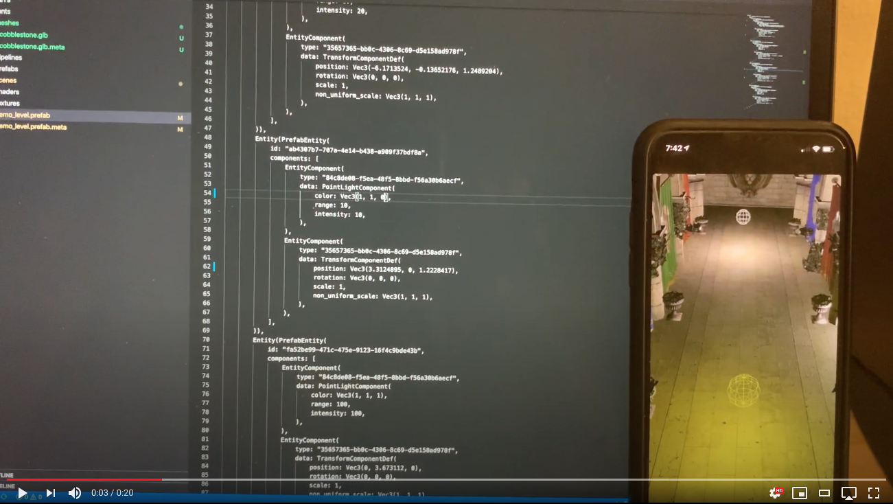
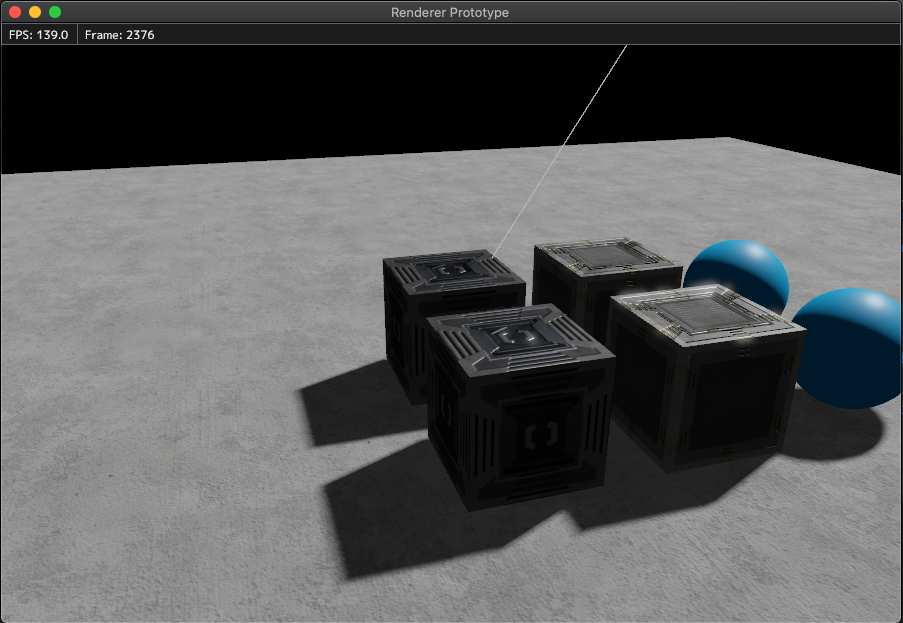

# Rafx

Rafx is a multi-backend renderer that prioritizes performance, flexibility, and productivity. It optionally integrates 
with the [`distill`](https://github.com/amethyst/distill) asset pipeline to provide workflows and tools suitable
for real-world projects with multidisciplinary teams.

This crate contains several layers:
 * `rafx-api`: Low-level graphics API abstraction 
 * `rafx-framework`: Mid-level framework that eases resource management, lifetime handling, and draw call dispatching
 * `rafx-assets`: Asset layer that integrates with [`distill`](https://github.com/amethyst/distill)
   
Rafx also provides tools for building shaders and packing assets.

Rafx supports most mainstream platforms via `vulkan` and `metal` backends. Proprietary platforms can be supported by
adding an additional backend.

 * [**Documentation**](docs/index.md)
 * Run `cargo doc --no-deps --open` in the root of the crate (docs.rs is incomplete because it does not build with features)

[](https://github.com/aclysma/rafx/actions)

[](https://www.youtube.com/watch?v=Ks_HQbejHE4 "Video of Renderer in Use")

[^ Video of this renderer running on iOS hardware](https://www.youtube.com/watch?v=Ks_HQbejHE4) 



## Roadmap

 * The API of `rafx-api` is unlikely to change significantly
 * `rafx-framework` and `rafx-assets` may get some refactoring/improvements based on demo improvements and dogfooding in
   other projects
 * For the near-term future, the focus will be on:
     * Adding more documentation
     * Maturing the existing backends
     * Extending the demo with more rendering techniques
   
**This crate will use semantic versioning rules after 0.1.0 of this project has been published. The
0.0.x versions do not follow semantic versioning rules.**

## Running the Demo

The demo should be run from the root of the repository. These commands should clone the repo
and run the demo.

```
git clone https://github.com/aclysma/rafx.git
cd rafx
cd demo
cargo run --bin demo --release --features "[BACKEND_FEATURE]"
```

BACKEND_FEATURE should either be "rafx-vulkan" or "rafx-metal"

Running in release reduces logging and disables GPU validation. The first time it will load more slowly because it
has to import the assets, including a GLTF mesh with large textures. **Using profile overrides to optimize upstream crates
is highly recommeneded. Asset processing is extremely slow in debug mode.** (i.e. 30s instead of 2s)

The demo uses SDL2 and in debug mode, vulkan validation. If you have trouble running the demo, please check that
dependencies for both SDL2 and vulkan are available.

### Demo Features

* Render thread decoupled from main thread [(diagram)](docs/pipelining.png)
* Shader build pipeline [(diagram)](docs/shader-processor.png)
* Offline texture compression and mipmap generations (via 
  [basis-universal](https://github.com/BinomialLLC/basis_universal) format)
* Asynchronous asset loading
* Assets can be streamed to remote hardware (i.e. a phone)
* OR assets can be cooked into a binary blob for shipping
* Hot-reloading assets (needs more work, some asset types do not work reliably)
* Render graph can be used for efficient and flexible definition of a render pipeline, including rendering to textures
  and multiple cameras.
* Auto-generated shader bindings make working with descriptor sets convenient and less error prone.
* Material System supporting multiple passes
* Multi-camera support (to produce shadow maps, for example)
* Demo game state stored in ECS (NOTE: demo uses legion but the renderer is ECS-agnostic)
* PBR Meshes
* Sprites
* Debug Draw
* imgui
* HDR Pipeline with Bloom
* Point, Spot, and Directional Lights
* Multiple Spot/Directional/Point light soft shadows

## Tools

The renderer includes a few tools for processing shaders and packing data in a binary blob.

### Shader Processor

This tool parses GLSL and produces matching rust code. This makes working with descriptor sets easier and safer!
 * The tool is located at [/shader-processor](rafx-shader-processor)
 * The demo includes a `shaders` crate to compile the generated rust code. It's located at [/demo/shaders](demo/shaders).
   Just the rust code is auto-generated, not the Cargo.toml.
 * The easiest way to "refresh shaders" in the demo is to hit compile.bat or compile.sh in that folder
 * You can `cargo install rafx-shader-processor`. Be sure to install the same version as you include in your project.
   Also, don't forget to update it if you update your project's dependencies!


The shader processor produces the following assets artifacts

* API-specific such as compiled SPIR-V or metal source code
* Metadata used by rafx at runtime
* Rust code that makes working with the shader easier
* Intermediate formats for debugging/inspection

The shader package can be loaded as an asset and contains everything needed to load a compiled shader.
 
### Packaging Assets

This tool currently is only useful for packing assets.
 * Pack files like this: `run --package cli -- --pack out.pack`
 * Run the demo like this: `run --package demo -- --packfile out.pack`
 * You'll likely want to create a binary from your own main.rs for this tool. That way you can add your own resource
   types.

## Features

 * `rafx-vulkan`: Use the vulkan backend
 * `rafx-metal`: Use the metal backend

## Crates

 * `rafx-base` - Shared helpers/data structures. Nothing exciting
 * `rafx-api` - Rendering API abstraction layer.
   * Vulkan backend for windows/linux
   * Metal backend for macOS/iOS
 * `rafx-nodes` - Inspired by the 2015 GDC talk "Destiny's Multithreaded Rendering Architecture." (A low-budget
   version and jobs are not actually MT yet)
   * A job system with extract, prepare, and write phases
   * Rendering is pipelined with simulation thread, and the job structure is intended to be highly parallel
   * Handles multiple views and phases allowing advanced features like shadow maps
   * Flexible sorting mechanism for interleaving and batching write commands from multiple rendering features
 * `rafx-visibility` - Placeholder visibility system. Doesn't do anything yet (returns all things visible all the 
   time). See the GDC talk for more info on how this will work.
 * `rafx-framework` - Resource management for images, buffers, descriptor sets, etc.
   * Most things are hashed and reference counted
   * Provides a render graph
   * Nearly all assets are data-driven from serializable and hashable structures rather than hard-coded.
   * Buffers and images are asynchronously uploaded on dedicated transfer queue when available
   * Multi-pass material abstraction with bindable parameters
 * `rafx-assets` - An asset loading and management system.
   * Assets can hot reload from files (but see [#14](rafx/issues/14))
   * Because distill pre-processes and stores cached assets as they change, custom processing/packing can be
     implemented while maintaining extremely fast load times. For example, texture compression could be implemented
     as an import step.  
   * Separate multi-thread friendly path for creating assets at runtime

## License

Licensed under either of

* Apache License, Version 2.0, ([LICENSE-APACHE](LICENSE-APACHE) or http://www.apache.org/licenses/LICENSE-2.0)
* MIT license ([LICENSE-MIT](LICENSE-MIT) or http://opensource.org/licenses/MIT)

at your option.

### Upstream Dependencies
The demo/fonts directory contains several fonts under their own licenses:
 * [Feather](https://github.com/AT-UI/feather-font), MIT
 * [Material Design Icons](https://materialdesignicons.com), SIL OFL 1.1
 * [FontAwesome 4.7.0](https://fontawesome.com/v4.7.0/license/), available under SIL OFL 1.1
 * [`mplus-1p-regular.ttf`](http://mplus-fonts.osdn.jp), available under its own license.

The assets/blender contains some shaders from from https://freepbr.com, available under [its own license](demo/assets/blender/pbr_texture_attribution.txt)

The skyboxes are from:
 * https://opengameart.org/content/space-skyboxes-0 (CC0)
 * http://www.humus.name/index.php?page=Textures (CC BY 3.0)

Some dependencies may be licensed under other terms. These licenses include "ISC", "CC0-1.0", "BSD-2-Clause",
"BSD-3-Clause", and "Zlib". This is validated on a best-effort basis in every CI run using cargo-deny.

### Acknowledgements

Rafx benefits from many [great ideas and projects](docs/acknowledgements.md)!

## Contribution

Unless you explicitly state otherwise, any contribution intentionally
submitted for inclusion in the work by you, as defined in the Apache-2.0
license, shall be dual licensed as above, without any additional terms or
conditions.

See [LICENSE-APACHE](LICENSE-APACHE) and [LICENSE-MIT](LICENSE-MIT).
