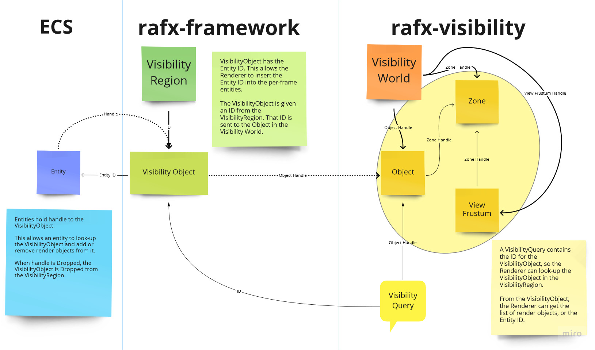

# Visibility Region



A `VisibilityRegion` is a ref-counted wrapper around 2 `Zones`.  One of the zones is designated "static" and the other designated "dynamic". When registering objects with the region, the application may pick if it is "static" or "dynamic" -- this will assign it to the corresponding `Zone` and return a `VisibilityObjectArc`. Note that the "static" or "dynamic" assignment is not a meaningful distinction by the underlying `VisibilityWorld` -- it is ok to move an object that was registered as "static". The reason for separating "static" and "dynamic" assignments is to support a future capability for running the "static" visibility calculation earlier in the frame and combining it with the "dynamic" visibility later in the frame. [1] An application view is registered with the `VisibilityRegion` and returned as a `ViewFrustumArc`.

The `VisibilityObjectArc` is a ref-counted wrapper around an `ObjectHandle`. This struct contains functions for setting the position, `id`, and other fields. The set functions are implemented under the hood using async commands over a channel to the `VisibilityWorld`. Each `VisibilityObjectArc` contains a list of features registered with that handle. Particular features may be shown or hidden on an entity in the world by adding or removing the feature from the `VisibilityObjectArc` associated with that entiy.

The `ViewFrustumArc` is a ref-counted wrapper around 1 or 2 `ViewFrustumHandle` representing a view of the "static" `Zone` and a view of the "dynamic" `Zone` in the `VisibilityRegion`. This struct contains functions for setting the location, `id`, projection, and querying for visibility. The set functions are implemented under the hood using async commands over a channel to the `VisibilityWorld`. Each `RenderView` requires a `ViewFrustumArc` so that visibility can be calculated for that view.

`EntityId` is a helper to transmute between a struct `T: Copy` with the same as a `u64` and the `u64` required for the `id` in the `VisibilityWorld`. 

```rust
let entity = world.push((transform_component, mesh_component));
let mut entry = world.entry(entity).unwrap();
entry.add_component(VisibilityComponent {
    handle: {
        let handle = visibility_region.register_static_object(
            EntityId::from(entity),
            load_visible_bounds(&floor_mesh_asset),
        );
        handle.set_transform(
            transform_component.translation,
            transform_component.rotation,
            transform_component.scale,
        );
        handle.add_feature(floor_mesh.as_raw_generic_handle());
        handle
    },
});
```

When a `RenderView` is aded to the frame packet using `add_view`, the associated `ViewFrustum` is queried for visibility. Only visible features relevant to the `RenderView` will be added to the frame packet.

[1] http://advances.realtimerendering.com/destiny/gdc_2015/Tatarchuk_GDC_2015__Destiny_Renderer_web.pdf