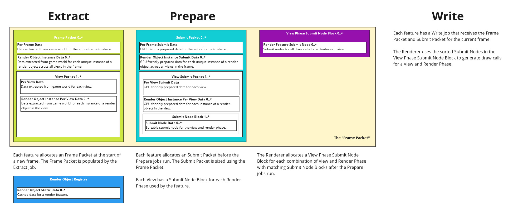

# Renderer Architecture

`rafx-renderer` and the `rafx-framework` `render_features` were inspired by the 2015 GDC talk "[Destiny's Multithreaded Rendering Architecture](http://advances.realtimerendering.com/destiny/gdc_2015/Tatarchuk_GDC_2015__Destiny_Renderer_web.pdf)". 

There is a video available at https://www.youtube.com/watch?v=0nTDFLMLX9k.



## Comparison with Destiny

The following is a comparison of `rafx` with `Destiny` in a page-by-page (using the PDF slides linked above!) manner to 
indicate compare or contrast names or design decisions between the architecture described for `Destiny` and the one implemented
by `rafx`. Each note will be preceded by a page number. Generally the notes will be in the same order as the `Destiny` slides
such that it is possible to read the `Destiny` slides and refer to this list for any differences in a mostly straightforward way.

Code examples from `rafx` will be placed into a code block:
```rust
// Like this.
```

Quotes from the `Destiny` slides will be placed into a quote block:
> Like this.

- (pg 55) A `RenderObject` is cached data. It should be infrequently, if ever, updated. `RenderObjects` are registered with 
  a `RenderObjectSet`.
- (pg 119) A `RenderObject` is associated with a `RenderFeature`. The `RenderFeature` completely defines the cache-coherent 
  structure of that feature in the frame packet for all extract / prepare / submit work.
   > Each render object type maps to a render feature which is the basic encapsulation unit in our architecture. We group render 
  > functionality by same data representation and code paths. For example, most of the skinned characters need dynamic transforms 
  > for skinned data, shaders and meshes, and iterate over the mesh containers to generate drawcalls, uploading skinned matrices 
  > to the GPU.
- (pg 61, 62, 121) Entities have one or more `RenderObjectComponent`s to own any `RenderObjectHandle`s. An entity can have
  an arbitrary number of `RenderObjectHandle`s associated with it.
- (pg 63, 64) Entities have a `VisibilityComponent` with a handle to the `VisibilityObject`. The `VisibilityObject` contains 
  the same `RenderObjectHandle` as the entity, but as a flat list of `RenderObjectId`s instead. The `VisibilityObject` points
  back to the entity via an `ObjectId`.
- (pg 71, 75) After each game frame, `compute_views_job` determines the views needed for rendering the next frame. This 
  would look something like "compute main view visibility, then grab all of the visible lights, reflective surfaces, etc".
 
  **DISCREPANCY:** `compute_views_job` does not exist in `rafx` today. The closest is something like `add_render_views`.
- (pg 97) The `compute_views_job` could be accelerated by predicting static visibility -- it's not actually part of the 
  renderer for that reason. It's expected that the game (or render graph, or whatever) will implement this in whatever way 
  makes sense.
- (pg 78) We run visibility queries on all views in parallel in `run_view_visibility_jobs`. Parallelization is handled by
  the `RendererThreadPool` with `ViewVisibilityJob`s.
- (pg 76, 79) Using those visibility results, we reserve any needed frame packets in `calculate_frame_packet_size`,
  `new_frame_packet`, and `populate_frame_packet`. This occurs in  parallel across _features_ through `RendererThreadPool`. 
  For each feature, we look at each view to determine if it's relevant to that feature with `is_view_relevant`. If it is, 
  we reserve space for a view packet. If there's no views relevant for the feature, we drop it entirely -- nothing is allocated. 
  Otherwise, we perform all allocation of the `FramePacket` for that feature _at once_. This is analogous to Destiny's 
  "populate render nodes" job.
> The next job we’re going to run for this view is the populate render nodes job. This is the job that sets up the cache 
> coherent arrays of data we call render nodes that the rest of the job chain will operate on. From this point onward, 
> rendering jobs be driven from an array of render nodes. Each render nodes maps to a unique render object visible in each 
> view. This data structure is defined to be very compact for iteration efficiency
- (pg 81) The `RenderFeatureFramePacket` for each feature is driven by feature-specific types. This allows each feature 
  to reserve space for exactly what it needs up front.
> we selectively choose what data to store in the render nodes by type. The view node can also allocate data in the frame 
> packet if needed. This allocation details are defined uniquely by each render object type (which is stored in the view node).
- Nomenclature note: `per frame render node` is replaced by `RenderObjectInstance` and `per view render node` is `RenderObjectInstancePerView`. 
  Data that is only needed for a frame is `PerFrame` and only needed for a view is `PerView`.
- `RenderObjectInstance` allocations point back to the `RenderObject` and entity (via the `ObjectId`).
- `RenderObjectInstancePerView` allocations point back to the `RenderObjectInstance`.
- (pg 86) Run extract jobs in `run_extract_jobs` in parallel. `RendererThreadPool` controls the parallelization of the
`RenderFeatureExtractJob`s.
> For each view node in the view packet, we’re going to extract data out of the game state object into the frame packet. 
> The core renderer will iterate coherently over the view nodes sorted by render object type and execute extract job entry 
> point for each render object type. Those jobs will operate on only this data as inputs:-Individual frame and view nodes 
> for that visible element-Statically cached data from the corresponding render object. During extract, we also reach out 
> to the game object using the handle cached in the render object.
- (pg 90) see also
> During extract, we actually generate separate jobs to go <wide> during extract. We generate multiple extract jobs for 
> each view. The jobs are generated with smart batching for different render objects types.
- (pg 215) The parallelization can be controlled per feature in the implementation of `RendererThreadPool`. The example
  in `DemoRendererThreadPool` shows one way to do so.
- (pg 87) To "reach out to the game object", use the `ObjectId` in the `RenderObjectInstance`. This should be the same as
  the game world's entity ID.
- (pg 100) Each `RenderFeature` can create a `RenderFeaturePrepareJob`. The prepare job will "consume" the `FramePacket` 
  from the extract job to avoid allocations. The `RenderFeaturePrepareJob` writes into a `SubmitPacket` created by 
  `new_submit_packet`. The closest comparison to Destiny for the `SubmitPacket` is if the `FramePacket` was divided in two --
  "prepared for GPU" data goes into the `SubmitPacket` and "extracted from world" data goes into the `FramePacket`.
- (pg 111, pg 120) The `RenderFeatureExtractJob` can be easily implemented by an `ExtractJob` wrapping the `ExtractJobEntryPoints` 
  trait. Only the necessary end points must be implemented. Ditto for `RenderFeaturePrepareJob` with `PrepareJob` and 
  `PrepareJobEntryPoints`. The writers just use `RenderFeatureWriteJob` -- at this point in time, there's no generic
  framework scaffolding for them.
> Each render feature is implemented with a unique feature renderer responsible for all work for that graphics feature. 
> Feature renderers are the main interface for implementing graphics features in the Destiny engine. This interface defines 
> how graphics features represent their cached render data; how we extract dynamic data from game objects into frame packet 
> render nodes, how we convert that data to GPU-friendly formats, and, most importantly, the code path to render these objects. 
> Feature renderer interface exposes entry points for each of our engine’s phases which the core renderer architecture converts 
> into jobs. This interface also provides data encapsulation to allow safe multi-threaded data access
```rust
    /// Called once at the start of the `extract` step when any `RenderView` in the frame is
    /// relevant to this `RenderFeature`.
    fn begin_per_frame_extract(
        &self,
        _context: &ExtractPerFrameContext<'extract, '_, Self>,
    ) {
    }

    /// Called once for each instance of an `Entity` and `RenderObject` in the frame matching this
    /// `RenderFeature`.
    fn extract_render_object_instance(
        &self,
        _job_context: &mut Self::RenderObjectInstanceJobContextT,
        _context: &ExtractRenderObjectInstanceContext<'extract, '_, Self>,
    ) {
    }

    /// Called once for each instance of an `Entity` and `RenderObject` in each `RenderView` relevant
    /// to this `RenderFeature`.
    fn extract_render_object_instance_per_view(
        &self,
        _job_context: &mut Self::RenderObjectInstancePerViewJobContextT,
        _context: &ExtractRenderObjectInstancePerViewContext<'extract, '_, Self>,
    ) {
    }

    /// Called once for each relevant `RenderView`. This function is only run after all instances of
    /// `extract_render_object_instance_per_view` have finished for that `RenderView`.
    fn end_per_view_extract(
        &self,
        _context: &ExtractPerViewContext<'extract, '_, Self>,
    ) {
    }

    /// Called once at the end of the `extract` step when any `RenderView` in the frame is
    /// relevant to this `RenderFeature`.
    fn end_per_frame_extract(
        &self,
        _context: &ExtractPerFrameContext<'extract, '_, Self>,
    ) {
    }
```
- (pg 125) The above interface ensures that the extract jobs only read from the world and write to the their frame packet. 
  An example follows.
```rust
    fn extract_render_object_instance(
        &self,
        job_context: &mut RenderObjectsJobContext<'extract, MeshRenderObject>,
        context: &ExtractRenderObjectInstanceContext<'extract, '_, Self>,
    ) {
        let render_object_static_data = job_context
            .render_objects
            .get_id(context.render_object_id());

        let mesh_asset = self
            .asset_manager
            .committed_asset(&render_object_static_data.mesh);

        context.set_render_object_instance_data(mesh_asset.and_then(|mesh_asset| {
            let entry = self.world.entry_ref(context.object_id().into()).unwrap();
            let transform_component = entry.get_component::<TransformComponent>().unwrap();
            Some(MeshRenderObjectInstanceData {
                mesh_asset: mesh_asset.clone(),
                translation: transform_component.translation,
                rotation: transform_component.rotation,
                scale: transform_component.scale,
            })
        }));
    }

```
> We provided an interface for feature renderers entry points with strict rules for data they are allowed to read or write
> at each entry point. Feature renderers could only read the render node data and statically cached render object data. 
> They are also only allowed to output to frame packet data. The latter was done to automatically ensure synchronization 
> –double-buffering of dynamic data was automatic for feature writers as long as they wrote to the frame packet.
- (pg 126) It also means that parallelization isn't apparent to the feature writer.
> The core renderer architecture generates jobs for each phase by batching across multiple visible render objects of the
> same feature type for several entry points (for example, batching all extract entry points into one extract job). This 
> jobification is done transparently to feature writers.
- (pg 134, 138) Each extract job is running in parallel, but within that extract job there is a well-defined order for the
  entry points. First, `begin_per_frame_extract` is called. Then, possibly in parallel, `extract_render_object_instance` 
  is called for each entity in the frame. Then, `extract_render_object_instance_per_view` is called in parallel across all 
  views for each entity visible in each view. As each view finishes processing, `end_per_view_extract` is called for that
  view. After all views have finished, `end_per_frame_extract` is called. The same order applies to the prepare jobs.
> Extract and prepare computations anddata aresplit up by frequency (view, frame, object).This allowed us to share data 
> across different views, across different render objects to save memory in frame packet (ex: only need one copy of skinning 
> transforms for any render objects using the same game object), and performance (only compute skinning transforms once 
> for all render objects using them).
> For example, we run extract and prepare per frame operations to perform expensive computations that have to happen only 
> once per entire frame as long as this render object is visible in any view.
- (pg 135) The parallelization is driven by the `RendererThreadPool` implementation and the synchronization is driven by 
  custom collections like `AtomicOnceCellArray` and generic implementations of `ExtractJob` or `PrepareJob`.
> The core architecture setsup synchronization primitives to ensure safe multi-threaded access. When feature renderers 
> writers write code for ‘extract_per_frame’ for example, they don’t need to worry that this entry point will be executed 
> from different jobs and may write to the same data in frame packet. However, it is important to use a performant 
> synchronization method for this operation since it will be a high-frequency operation per frame.
- (pg 139) **NOTE:** `rafx` does not implement the "per game object" optimization for data shared _across 
  features_ but I don't believe it would be hard to extend it in that direction.
- (pg 144) The steps to write a feature: copy and paste a feature template, find / replace the name, define your frame
  packet and submit packet data, then implement the extract, prepare, and write jobs using the defined entry points. An
  example frame packet:
```rust
pub struct MeshRenderFeatureTypes;

//---------
// EXTRACT
//---------

pub struct MeshPerFrameData {
    pub depth_material_pass: Option<ResourceArc<MaterialPassResource>>,
}

pub struct MeshRenderObjectInstanceData {
    pub mesh_asset: MeshAsset,
    pub translation: Vec3,
    pub rotation: Quat,
    pub scale: Vec3,
}

#[derive(Default)]
pub struct MeshPerViewData {
    pub directional_lights: [Option<ExtractedDirectionalLight>; 16],
    pub point_lights: [Option<ExtractedPointLight>; 16],
    pub spot_lights: [Option<ExtractedSpotLight>; 16],
    pub num_directional_lights: u32,
    pub num_point_lights: u32,
    pub num_spot_lights: u32,
}

pub struct ExtractedDirectionalLight {
    pub light: DirectionalLightComponent,
    pub object_id: ObjectId,
}

pub struct ExtractedPointLight {
    pub light: PointLightComponent,
    pub transform: TransformComponent,
    pub object_id: ObjectId,
}

pub struct ExtractedSpotLight {
    pub light: SpotLightComponent,
    pub transform: TransformComponent,
    pub object_id: ObjectId,
}

impl FramePacketData for MeshRenderFeatureTypes {
    type PerFrameData = MeshPerFrameData;
    type RenderObjectInstanceData = Option<MeshRenderObjectInstanceData>;
    type PerViewData = MeshPerViewData;
    type RenderObjectInstancePerViewData = ();
}

pub type MeshFramePacket = FramePacket<MeshRenderFeatureTypes>;

//---------
// PREPARE
//---------

pub const MAX_SHADOW_MAPS_2D: usize = 32;
pub const MAX_SHADOW_MAPS_CUBE: usize = 16;

pub struct MeshPartDescriptorSetPair {
    pub depth_descriptor_set: DescriptorSetArc,
    pub opaque_descriptor_set: DescriptorSetArc,
}

pub struct MeshPerFrameSubmitData {
    pub num_shadow_map_2d: usize,
    pub shadow_map_2d_data: [shaders::mesh_frag::ShadowMap2DDataStd140; MAX_SHADOW_MAPS_2D],
    pub shadow_map_2d_image_views: [Option<ResourceArc<ImageViewResource>>; MAX_SHADOW_MAPS_2D],
    pub num_shadow_map_cube: usize,
    pub shadow_map_cube_data: [shaders::mesh_frag::ShadowMapCubeDataStd140; MAX_SHADOW_MAPS_CUBE],
    pub shadow_map_cube_image_views: [Option<ResourceArc<ImageViewResource>>; MAX_SHADOW_MAPS_CUBE],
    pub shadow_map_image_index_remap: [Option<usize>; MAX_SHADOW_MAPS_2D + MAX_SHADOW_MAPS_CUBE],
    pub mesh_part_descriptor_sets: Arc<AtomicOnceCellStack<MeshPartDescriptorSetPair>>,
    pub opaque_per_view_descriptor_set_layout: Option<ResourceArc<DescriptorSetLayoutResource>>,
}

pub struct MeshRenderObjectInstanceSubmitData {
    pub mesh_part_descriptor_set_index: usize,
}

impl SubmitPacketData for MeshRenderFeatureTypes {
    type PerFrameSubmitData = Box<MeshPerFrameSubmitData>;
    type RenderObjectInstanceSubmitData = MeshRenderObjectInstanceSubmitData;
    type PerViewSubmitData = MeshPerViewSubmitData;
    type RenderObjectInstancePerViewSubmitData = ();
    type SubmitNodeData = MeshDrawCall;

    type RenderFeature = MeshRenderFeature;
}

pub type MeshSubmitPacket = SubmitPacket<MeshRenderFeatureTypes>;

//-------
// WRITE
//-------

pub struct MeshPerViewSubmitData {
    pub opaque_descriptor_set: Option<DescriptorSetArc>,
    pub depth_descriptor_set: Option<DescriptorSetArc>,
}

pub struct MeshDrawCall {
    pub mesh_asset: MeshAsset,
    pub mesh_part_index: usize,
    pub mesh_part_descriptor_set_index: usize,
}
  ```
- (pg 147) **DISCREPANCY:** `rafx`'s equivalent of the "high-level submit script" is the `RenderGraph`.
- (pg 159) This is the role of the `RenderGraph`.
- (pg 160) A "submit view" directive is kind of like the set of all `write_view_phase` in `PreparedRenderData` for `RenderPhases`
  relevant to that `RenderView`.
- (pg 168, pg 169) What Destiny calls a "render pass" is the same as `rafx` -- like `OpaquePass`. However, what Destiny 
  calls a "render stage" is called a `RenderPhase` in `rafx`.
> Certain render passes are required to render regardless of any data present in the pipeline –for example, the shading 
> pass, the tone mapping and resolve pass, etc. Those are not considered render stages in our system. Render stage directives 
> are a high-level command to execute submission for a specific view for a specific stage of the frame pipeline where we 
> might have content-driven data (for example, G-buffer or transparents, or shadows elements).
- (pg 170) This pseudocode is pretty much exactly what `write_view_phase` looks like. 
```rust
write_view_phase::<OpaqueRenderPhase>(&main_view, &mut write_context)?
```
- (pg 172) A `RenderObject` is "subscribed" to a `RenderPhase` when the `RenderFeature` creates `SubmitNodes` for that 
`RenderObject` in the `RenderPhase`.
- (pg 173) **DISCREPANCY:** The Destiny talk makes it sound like the `RenderObject`s define the mapping directly, e.g.
  rather than `SpriteRenderObject` pointing back to a `SpriteRenderFeature` with subscriptions to the `Opaque` and `Transparent`
  render phases, the `SpriteRenderObject` would subscribe directly to either `Opaque` or `Transparent` depending only on
  if it has transparency.
- (pg 174) A `RenderView` subscribes to one or more `RenderPhase` at runtime with the `RenderPhaseMask`.
- (pg 182) The sorting of visible render objects for a view is done by `ViewVisibilityJob::query_visibility`.
- (pg 182) Building counts for each `RenderPhase` is basically the point of `calculate_frame_packet_size`.
- (pg 182) `rafx` has a `ViewPhaseSubmitNodeBlock` for _all_ submit nodes in a `RenderView` and `RenderPhase`, and a separate
`RenderFeatureSubmitNodeBlock` for submit nodes specific to a `RenderFeature`.
- (pg 183) Sorting is handled by the `SubmitNodeSortFunction` defined when registering a `RenderPhase`. The actual sort occurs
  during `create_submit_node_blocks_for_view` in `create_submit_node_blocks`.
- (pg 184) Creating arbitrary submit nodes for render objects is handled by the `AtomicOnceCellStack`.
- (pg 185) An example of data duplication -- the `RenderObjectInstancePerView` actually _contains_ a copy of the `RenderObjectInstance`
  so that we don't need to jump to another array to lookup those fields.
- (pg 186) This is `write_view_phase` again, using the `RenderFeatureWriteJob` entry points for each `RenderFeature` needed.
- (pg 187) **DISCREPANCY:** `rafx` doesn't perform the batching described for submit nodes.
- (pg 188) Generally a `RenderFeatureWriteJob` is implemented against the data in the `FramePacket`, `SubmitPacket`, and maybe
  some other persistent storage like a `RenderObjectSet`.
- (pg 193) **DISCREPANCY:** `rafx` doesn't go wide during the write / submit phase.
- (pg 215) Dynamic load balancing isn't something `rafx` provides out of the box -- the expectation is that the 
  application will implement whatever threading or parallelization is needed inside of the `RendererThreadPool`. This would
  include cost functions or other batching. `DemoRendererThreadPool` provides a very simple, toy example of a way to adjust
  parallelization on a per-feature basis to scale with the number of render objects.